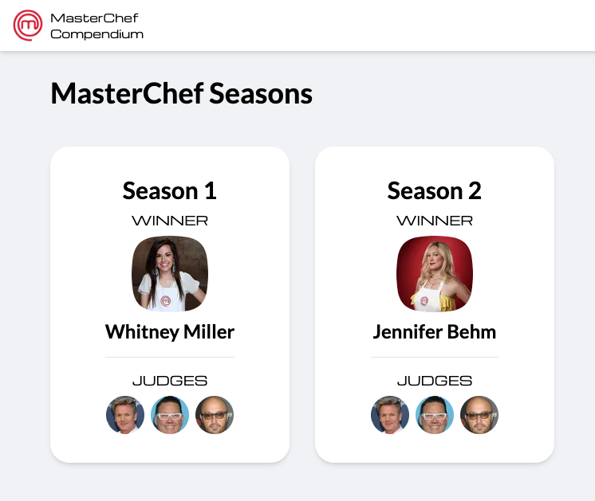

# mcc-next

This is a small side-project that I am currently developing that will serve as
a portfolio piece and as a learning tool for picking up NextJS, along with
sharpening and honing other skills.

## Background

This project will also be used to scratch a small, nerdy itch of mine, which is
to build a data-mining project around the television show MasterChef; hence the
project name, "mcc": MasterChef Compendium.

I've been a fan of the show for a while and have sometimes day dreamed of being
a contestant, which I will probably never, _ever_ do. Despite that, I've wanted
a tool that would allow me to record recipe information from cooking challenges
on the show so that I can correlate that data with challenge results that I've
scraped from
[Wikipedia](<https://en.wikipedia.org/wiki/MasterChef_(American_season_1)>).

Eventually I want to answer questions like,

- What was the success rate of contestants who have cooked a specific thing with
  a specific technique?
- What type of cuisine has been cooked the most historically on the show?
- Which specific type of food have contestants performed the best with? Which
  techniques? Which ingredients? Which have they performed the _worst_ with?

All very geeky and fun.

## Status

This project is currently in the early/middle stage of phase `1`:

1. Initial, navigable UI for the shows' season-episode-challenge-result data
   structure (like a wiki).
2. A data entry UI, used capture recipe information for each episode, built on
   top of `phase 1` work
3. Data mining, reporting, and visualization, derived from `phase 2` efforts

## Note

This is a side-project and learning tool. A few things that I've implemented so
far are still in-flight; there will be quite a bit of initial churn until I
settle on various ideas for different aspects of this project.

